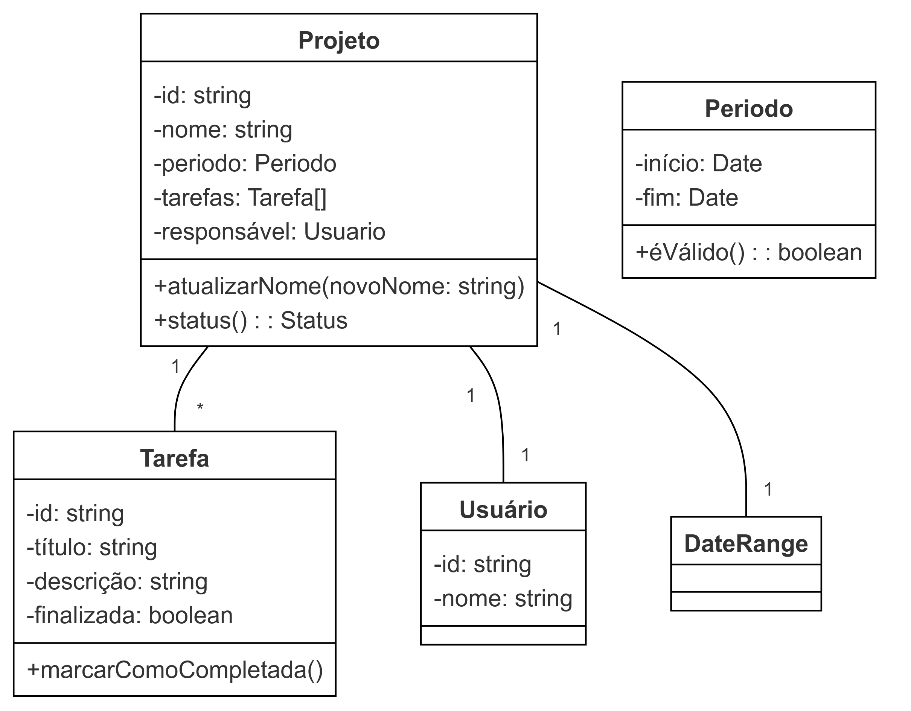

# Arquitetura de Software com TDD e DDD - WeekIT 2024

Este mini-curso foca na aplicação prática dos princípios de Desenvolvimento Orientado por Testes (TDD) e Design Orientado por Domínio (DDD) na construção de um sistema simples de gerenciamento de projetos.

## Autores

- [Herbert Duarte](https://github.com/HerbertDuarte)
- [Thallys Lemos](https://github.com/thallyslemos)

## Índice

- [Arquitetura de Software com TDD e DDD - WeekIT 2024](#arquitetura-de-software-com-tdd-e-ddd---weekit-2024)
  - [Autores](#autores)
  - [Índice](#índice)
  - [Introdução](#introdução)
  - [Conceitos de DDD](#conceitos-de-ddd)
  - [Noções Básicas de TDD](#noções-básicas-de-tdd)
  - [Visão Geral do Projeto](#visão-geral-do-projeto)
  - [Modelo de Domínio](#modelo-de-domínio)
  - [Aplicando Conceitos de DDD](#aplicando-conceitos-de-ddd)
  - [Configuração do Projeto](#configuração-do-projeto)
  - [Executando Testes](#executando-testes)
  - [Diagrama de Classes](#diagrama-de-classes)
  - [Configuração do Projeto](#configuração-do-projeto-1)
    - [Endpoints](#endpoints)

## Introdução

Este curso tem como objetivo proporcionar uma experiência prática na aplicação dos princípios de TDD e DDD para criar uma arquitetura de software robusta e sustentável. Vamos focar na construção da camada de domínio de um sistema de gerenciamento de projetos, demonstrando como essas metodologias podem levar a um código mais limpo e organizado que reflete de perto os requisitos de negócios.

## Conceitos de DDD

- Entidades
- Objetos de Valor
- Agregados
- Repositórios

## Noções Básicas de TDD

- Ciclo Red-Green-Refactor
- Escrevendo testes significativos
- Isolamento de testes

## Visão Geral do Projeto

Estamos construindo um sistema simples de gerenciamento de projetos com as seguintes entidades principais:

- Projeto
- Tarefa
- Usuário

## Modelo de Domínio

Nosso foco será na implementação e teste da camada de domínio, que encapsula a lógica de negócios principal de nossa aplicação.

## Aplicando Conceitos de DDD

Além das entidades básicas, aplicaremos os seguintes conceitos de DDD:

1. **Objeto de Valor**: Criar um objeto de valor `DateRange` para representar as datas de início e fim de um projeto.

2. **Agregado**: Tratar `Projeto` como uma raiz de agregado, com `Tarefa` como parte de seu agregado.


## Configuração do Projeto

Este projeto usa NestJS. Para configurá-lo:

1. Clone o repositório
2. Instale as dependências:
  ```
  npm install
  ```
3. Execute o servidor de desenvolvimento:
  ```
  npm run start:dev
  ```

## Executando Testes

Execute a suíte de testes usando Jest:

```
npm run test
```

## Diagrama de Classes




## Configuração do Projeto

- Este projeto usa NestJS. Para configurá-lo:

1. Clone o repositório.
   
2. Instale as dependências:
    ```bash
    npm install
    ```

1. Execute o servidor de desenvolvimento:

   ```bash
   npm run start:dev
   ```

2. Acesse o servidor em `http://localhost:3000`.
  ### Endpoints
  - `POST /projetos`: Cria um novo projeto.
    - Body da requisição:
      ```json
      {
          "nome": "TCC 1",
          "responsavel": "Herbert",
          "dataFim": "2021-12-31"
      }
      ```
  - `GET /projetos`: Retorna a lista de projetos.
    - Resposta esperada:
      ```json
      [
        {
          "periodo": {
            "dataInicio": "2024-10-16T15:30:21.697Z",
            "dataFim": "2021-12-31T00:00:00.000Z"
          },
          "id": "ece0c6a3-55bf-4d3c-88a8-2200845285e1",
          "nome": "Projeto 1",
          "responsavel": {
            "nome": "João",
            "id": "25e48c92-6f4e-4f5c-b9a0-ba6fbccec450"
          },
          "tarefas": []
        }
      ]
      ```